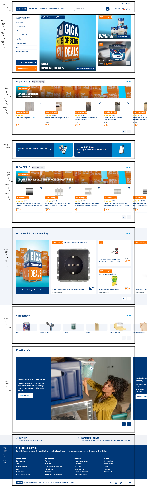
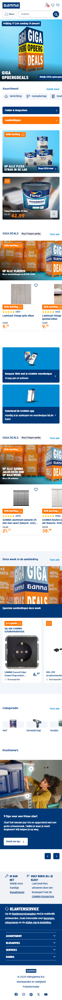
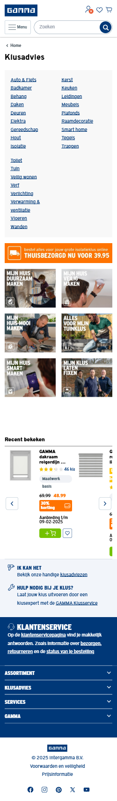
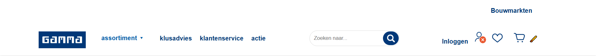
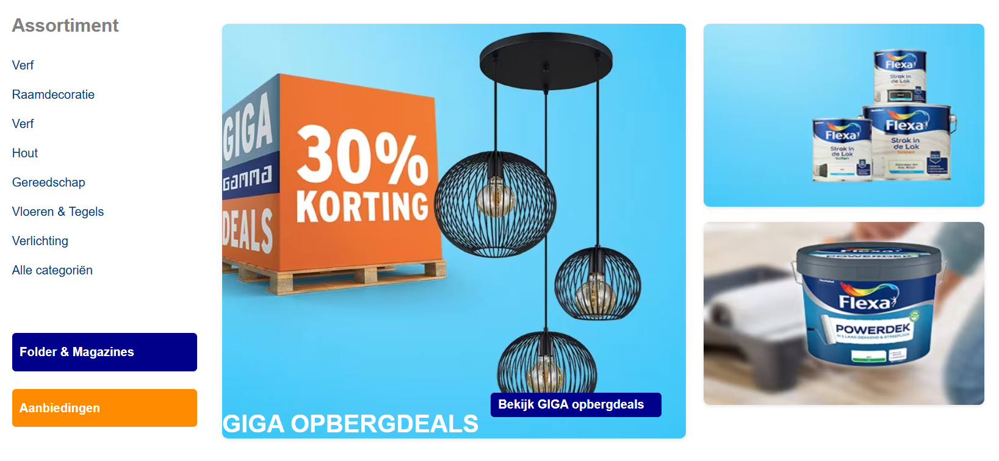
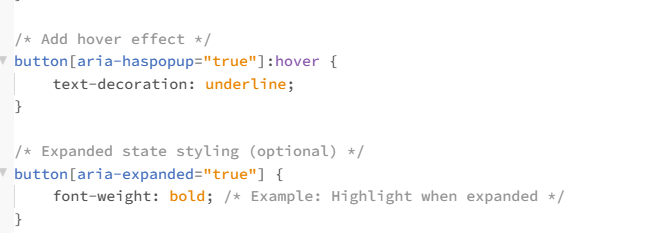

# Procesverslag
Markdown is een simpele manier om HTML te schrijven.  
Markdown cheat cheet: [Hulp bij het schrijven van Markdown](https://github.com/adam-p/markdown-here/wiki/Markdown-Cheatsheet).

Nb. De standaardstructuur en de spartaanse opmaak van de README.md zijn helemaal prima. Het gaat om de inhoud van je procesverslag. Besteedt de tijd voor pracht en praal aan je website.

Nb. Door *open* toe te voegen aan een *details* element kun je deze standaard open zetten. Fijn om dat steeds voor de relevante stuk(ken) te doen.

## Jij

  
uitwerken voor kick-off werkgroep

  ### Auteur:
  Alexander Plet

  #### Je startniveau:
  Blauw

  #### Je focus:
  Responsive
 

## Je website

  
uitwerken voor kick-off werkgroep

  ### Je opdracht:
  
  #### Screenshot(s) van de eerste pagina : 
  
  
  
  #### Screenshot(s) van de eerste pagina (small screen): 
  
  

  #### Screenshot(s) van de tweede pagina (small screen):
  
 

## Toegankelijkheidstest 1/2 (week 1)

  
uitwerken na test in de werkgroep

 
  ### Bevindingen
  Lijst met je bevindingen die in de test naar voren kwamen:
  - met nette semantische code kan de screenreader alle relevante html elementen voorlezen
  - het is de duty van designers om te coderen met screenreaders in gedachten

  #### Screenreader
  Hier korte omschrijving (met indien nodig afbeeldingen)
  - met nette semantische code kan de screenreader alle relevante html elementen voorlezen
  - is van belang zodat iedereen gebruik kan maken van een computer (internet)
  - mensen met beperkingen in hun zicht of motoriek zullen blij zijn als een website screenreader friendly is
  
  Hier een omschrijving van hoe het opgelost kan worden (met indien nodig afbeeldingen)

  #### Muis en Toetsenbord 
  Hier korte omschrijving (met indien nodig afbeeldingen)
  - met keyboard shortcuts zoals de pijltjes toetsen kan een website makkelijk genavigeert worden als de gebruiker niet met een muis kan werken ivm restricties

  #### Motoriek (shocks, elastiekjes)
  Hier korte omschrijving (met indien nodig afbeeldingen)
  - met keyboard shortcuts zoals de pijltjes toetsen kan een website makkelijk genavigeert worden als de gebruiker niet met een muis kan werken ivm restricties
  
  #### Visueel (brillen, contrast, kleurenblind, dark/light). 
  Hier korte omschrijving (met indien nodig afbeeldingen)
  - met contrast kan er gedacht worden om niet van die velle kleuren te gebruiken sinds iemand met kleurenblindheid bijvoorbeeld het verschil niet zal zien.
  - speel met contrast, dark/light modes
  

## Breakdownschets (week 1)

  
uitwerken na afloop 2e werkgroep

  ### de hele pagina: 

  ### dynamisch deel (bijv menu): 

  ### wellicht nog een dynamisch deel (bijv filter): 

## Voortgang 1 (week 2)

  
uitwerken voor 1e voortgang

  ### Stand van zaken
  hier dit ging goed & dit was lastig (neem ook screenshots op van delen van je website en code)
  Had de breakdown alleen voor voortgang 1.

  ### Agenda voor meeting
  
  Niet aanwezig

  ### Verslag van meeting
  hier na afloop snel de uitkomsten van de meeting vastleggen

  - gekeken naar de correcte html tags die horen bij welke gedeelte van de website

## Voortgang 2 (week 3)

  
uitwerken voor 2e voortgang

  ### Stand van zaken
  hier dit ging goed & dit was lastig (neem ook screenshots op van delen van je website en code)
  !
  
  Heb gewerkt aan hoe de navigatie gaat.

  ### Agenda voor meeting

  ### Verslag van meeting
  Niet aanwezig voor meeting

## Toegankelijkheidstest 2/2 (week 4)

  
uitwerken na test in 8e werkgroep

  ### Bevindingen
  Lijst met je bevindingen die in de test naar voren kwamen (geef ook aan wat er verbeterd is):

  #### Screenreader
  Hier korte omschrijving (met indien nodig afbeeldingen)

  Hier een omschrijving van hoe het opgelost kan worden (met indien nodig afbeeldingen)

  #### Muis en Toetsenbord 
  Hier korte omschrijving (met indien nodig afbeeldingen)

  Hier een omschrijving van hoe het opgelost kan worden (met indien nodig afbeeldingen)

  #### Motoriek (shocks, elastiekjes)
  Hier korte omschrijving (met indien nodig afbeeldingen)

  Hier een omschrijving van hoe het opgelost kan worden (met indien nodig afbeeldingen)

  #### Visueel (brillen, contrast, kleurenblind, dark/light). 
  Hier korte omschrijving (met indien nodig afbeeldingen)

  Hier een omschrijving van hoe het opgelost kan worden (met indien nodig afbeeldingen)

## Voortgang 3 (week 4)

  
uitwerken voor 3e voortgang

  ### Stand van zaken
  hier dit ging goed & dit was lastig (neem ook screenshots op van delen van je website en code)
  !

  ### Agenda voor meeting

  ### Verslag van meeting
  nth-of-type kan mij helpen met verschillende articles stylen
  Heb een beter beeld wat ik kan doen voor mijn microinteractie

## Eindgesprek (week 5)

  
uitwerken voor eindgesprek

  ### Je uitkomst - karakteristiek screenshots:
  

  ### Dit ging goed/Heb ik geleerd: 
  Ik heb geleerd dat er gebruik gemaakt kan worden met aria-labels in plaats van classes, DIVs en IDs

  !

  ### Dit was lastig/Is niet gelukt:
  Korte omschrijving met plaatjes

  

## Bronnenlijst

  
continu bijhouden terwijl je werkt

  Nb. Wees specifiek ('css-tricks' als bron is bijv. niet specifiek genoeg).

1. <a href="https://www.w3schools.com/">w3schools</a>
2. <a href="http://www.onlinewebfonts.com">oNline Web Fonts</a>
3. <a href="https://codepen.io/Axiol/pen/QWLRMVr">https://codepen.io/Axiol/pen/QWLRMVr</a>
4. ...
5. 
6. <a href="https://stackoverflow.com/questions/49934826/how-to-open-sub-menu-with-onclick-function-and-hide-with-onclick-function">https://stackoverflow.com/questions/49934826/how-to-open-sub-menu-with-onclick-function-and-hide-with-onclick-function</a>
7. <a href="https://stackoverflow.com/questions/39892794/toggle-image-in-pure-javascript">https://stackoverflow.com/questions/39892794/toggle-image-in-pure-javascript</a>

